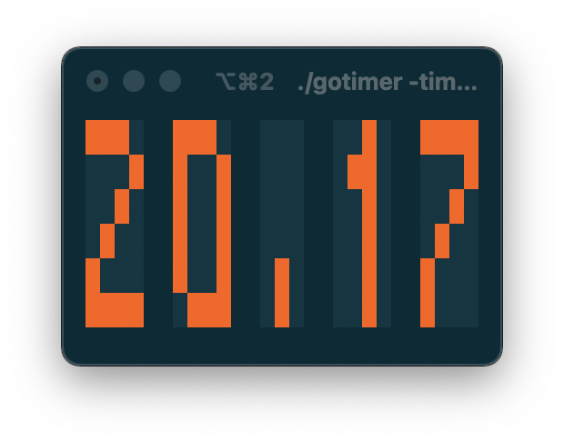

[](https://tldrlegal.com/license/-isc-license)
[](https://github.com/nwillc/gotimer/actions?query=workflow%3CI)
[](https://goreportcard.com/report/github.com/nwillc/gotimer)
---
# Go Timer

A simple terminal based digital timer written in Go to use as a Pomodoro time.



## Usage:

```bash
$ ./gotimer -h
Usage of ./gotimer:
  -color string
    	The display color (default "orangered")
  -time string
    	The time for the timer (default "25m")
  -version
    	Display version.
```

 - The time duration is given in hours, minutes and seconds: `#h#m#s`. 
 - Exit with Ctrl-C or ESC
 - Pause with SPACE
